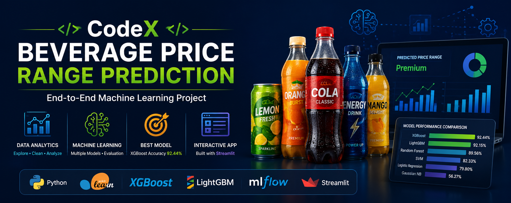
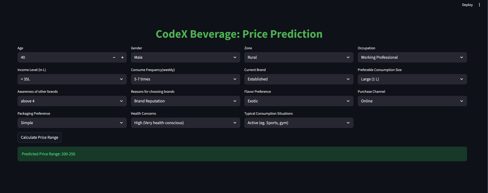
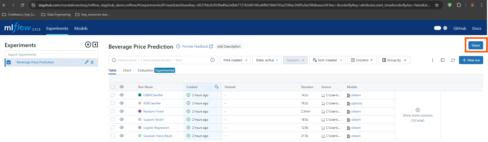
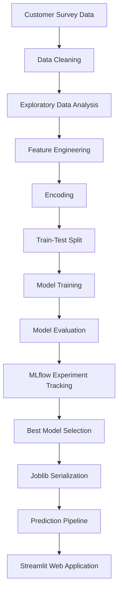

<p align="center">
  
</p>

<h1 align="center">🥤 CodeX Beverage Price Range Prediction</h1>

<p align="center">
An End-to-End Machine Learning Project for Predicting Customer Beverage Price Preferences using <b>XGBoost</b>, <b>MLflow</b>, and <b>Streamlit</b>.
</p>

<p align="center">


</p>

## 🚀 Live Demo

[](https://codex-beverage-price-range-prediction-6arifz9vdwuacl7kojcfgv.streamlit.app/)

👉 **Live Application:**  
https://codex-beverage-price-range-prediction-6arifz9vdwuacl7kojcfgv.streamlit.app/

---

# 📖 Project Overview

Selecting the right product price is one of the most critical business decisions in the **Fast-Moving Consumer Goods (FMCG)** industry. Understanding customers' willingness to pay enables companies to optimize pricing strategies, improve product positioning, and enhance customer satisfaction while maximizing revenue.

This project develops an **end-to-end Machine Learning solution** to predict a customer's preferred beverage price range based on demographic characteristics, purchasing behaviour, product preferences, brand awareness, and consumption habits.

The solution was built using an original dataset containing **30,010 customer records and 17 raw features**. The project involved extensive **data preprocessing, exploratory data analysis (EDA), feature engineering, categorical encoding, and model development** to transform raw customer information into meaningful predictive insights.

To identify the most effective predictive model, six machine learning algorithms were trained and evaluated:

- Logistic Regression
- Gaussian Naive Bayes
- Support Vector Machine (SVM)
- Random Forest
- LightGBM
- XGBoost

Among these, **XGBoost** achieved the highest **test accuracy of 92.44%** and was selected as the final production model.

The complete machine learning pipeline was enhanced with **MLflow** for experiment tracking and model comparison, while the final model was deployed through an interactive **Streamlit** web application that enables users to predict a customer's preferred beverage price range in real time.

This project demonstrates the complete machine learning lifecycle—from business problem understanding and data preparation to model evaluation, experiment management, and deployment—showcasing practical skills in **Python, Scikit-learn, XGBoost, LightGBM, MLflow, Streamlit, feature engineering, and end-to-end machine learning workflows**.

---

# 🎥 Project Demonstration

## 📺 Complete Walkthrough

Watch the complete project presentation here:

**▶ Video Demo**

https://drive.google.com/file/d/1teSLcMQ9Tl6HpYdKVhVMKiW2JA8Cl88O/view?usp=drive_link

The presentation covers:

- Business Problem
- Dataset Overview
- Data Cleaning
- Exploratory Data Analysis
- Feature Engineering
- Machine Learning Pipeline
- Model Comparison
- MLflow Experiment Tracking
- Streamlit Deployment
- Live Prediction

---

# ✨ Project Highlights

✅ End-to-End Machine Learning Pipeline

✅ Business-Oriented Feature Engineering

✅ Multi-Class Classification

✅ Comparison of Six Machine Learning Models

✅ MLflow Experiment Tracking

✅ Joblib Model Serialization

✅ Streamlit Deployment

✅ Real-Time Prediction

---

# 📸 Streamlit Application

The trained XGBoost model is deployed using **Streamlit**, providing an interactive interface for predicting a customer's preferred beverage price range based on demographic and behavioural information.

<p align="center">
  
</p>

**Key Features**

- Interactive user-friendly interface
- Customer demographic and behavioural input
- Real-time price range prediction
- Automated feature engineering and encoding
- Machine learning-powered inference using the trained XGBoost model

---

# 📈 MLflow Experiment Tracking

MLflow was used to track and compare machine learning experiments, monitor model performance, and select the best-performing model for deployment.

<p align="center">
  
</p>


# 🎯 Business Problem

Different customers prefer different beverage price ranges based on demographic and behavioural characteristics.

Businesses often struggle to:

- Identify customer purchasing power
- Understand brand preferences
- Design personalised marketing campaigns
- Optimise product pricing

The objective of this project is to predict the **most likely price range** a customer prefers, enabling more targeted pricing and marketing strategies.

---

# 📊 Dataset

The dataset contains customer survey responses with features such as:

- Age
- Gender
- Occupation
- Income Level
- Zone
- Current Brand
- Brand Awareness
- Packaging Preference
- Flavor Preference
- Purchase Channel
- Health Concerns
- Consumption Frequency
- Preferred Consumption Size
- Consumption Situation

### Target Variable

**Price Range**

This is a **Multi-Class Classification** problem.

---

# 🏗️ Project Workflow



---

# 🧹 Data Preprocessing

The dataset was prepared using several preprocessing techniques.

- Missing Value Handling
- Duplicate Removal
- Category Standardisation
- Outlier Detection
- Age Group Creation
- Feature Validation

---

# ⚙️ Feature Engineering

To improve predictive performance, multiple business-driven features were engineered.

### Age Group

Age values were grouped into:

- 18–25
- 26–35
- 36–45
- 46–55
- 56–70
- 70+

---

### Zone Affluence Score (ZAS)

A composite feature representing purchasing power using:

- Zone
- Income Level

---

### Brand Switching Indicator (BSI)

Identifies customers likely to switch brands.

---

### Consumption Frequency & Brand Awareness Score

Represents customer engagement.

---

# 🔄 Feature Encoding

### Label Encoding

Used for ordinal variables.

### One-Hot Encoding

Used for nominal variables.

---

# 🤖 Machine Learning Models

The following models were trained and evaluated.

| Model | Accuracy | Remarks |
|--------|---------:|---------|
| Logistic Regression | **79.80%** | Baseline linear classifier |
| Gaussian Naive Bayes | **56.27%** | Lowest performance due to strong independence assumptions |
| Support Vector Machine (SVM) | **82.33%** | Good classification performance |
| Random Forest | **89.56%** | Strong ensemble model with high accuracy |
| LightGBM | **92.15%** | Excellent gradient boosting performance |
| 🏆 XGBoost | **92.44%** | **Best Performing Model** |

---

# 🏆 Best Model

🥇 **XGBoost Classifier**

Reasons for selection:

- Highest accuracy
- Better generalisation
- Excellent multiclass performance
- Robust prediction capability

---

# 📈 MLflow Experiment Tracking

MLflow was used to compare different machine learning models by tracking:

- Model Name
- Training Duration
- Accuracy
- Parameters
- Evaluation Metrics

This made model comparison reproducible and simplified the selection of the best-performing algorithm.

---

# 💻 Streamlit Application

The trained model was deployed as an interactive web application using **Streamlit**.

Users can enter:

- Age
- Gender
- Occupation
- Zone
- Income Level
- Current Brand
- Purchase Channel
- Health Concerns
- Packaging Preference
- Flavor Preference
- Consumption Frequency
- Brand Awareness
- Consumption Size
- Consumption Situation

The application processes the input through the prediction pipeline and instantly returns the predicted beverage price range. The interface is built with multiple input widgets and calls a dedicated prediction function that performs feature engineering, encoding, and model inference before displaying the result.

---

# 📂 Repository Structure

```
codex-beverage-price-range-prediction/

│
├── data
│
├── notebooks/
│     └── price_range_prediction.ipynb
│
├── visuals/
│     ├── streamlit-ui.jpg
│     ├── feature_importance.png
│     ├── frequency_vs_price.png
│     ├── income_distribution.png
│     ├── ml_flow_output_demo.png
│
├── artifacts/
│     ├── app.py
│     ├── predict.py
│     ├── price_range_model.joblib
├── requirements.txt
├── README.md
├── LICENSE
└── .gitignore
```

---

# ⚡ Technology Stack

- Python
- Pandas
- NumPy
- Scikit-Learn
- XGBoost
- LightGBM
- Matplotlib
- Seaborn
- MLflow
- Streamlit
- Joblib
- Jupyter Notebook

---

# 🚀 Installation

```bash
git clone https://github.com/bhartishr28/codex-beverage-price-range-prediction.git

cd codex-beverage-price-range-prediction

pip install -r requirements.txt
```

Run the Streamlit application

```bash
streamlit run app.py
```

---

# 💼 Business Value

The solution enables organisations to:

- Predict customer price preference
- Improve customer segmentation
- Support pricing strategies
- Increase marketing effectiveness
- Make data-driven business decisions

---

# 🔮 Future Enhancements

- Hyperparameter Optimisation using Optuna
- SHAP Explainability
- Docker Deployment
- REST API using FastAPI
- AWS/Azure Deployment
- CI/CD Pipeline
- User Authentication

---

# 👩‍💻 About Me

## **Bharti Kumari**

MBA (Data Science)

B.E (Computer Science)

Former Credit Officer-Manager with 9+ years of banking experience transitioning into Data Science.

### Technical Skills

- Python
- SQL
- Machine Learning
- XGBoost
- LightGBM
- Streamlit
- MLflow
- Pandas
- NumPy
- Scikit-Learn
- Data Visualisation

---

# 🤝 Connect With Me

- 💼 LinkedIn: **https://www.linkedin.com/in/bhartikumari28/**
- 📧 Email: **bhartishr@gmail.com**
- 🌐 GitHub: **https://github.com/bhartishr28**

---

# ⭐ If you found this repository useful...

Please consider giving it a ⭐ to support the project.

---

<p align="center">

Made with ❤️ by <b>Bharti Kumari</b>

</p>
